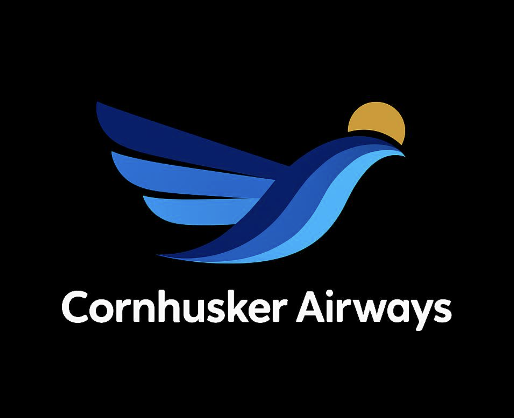
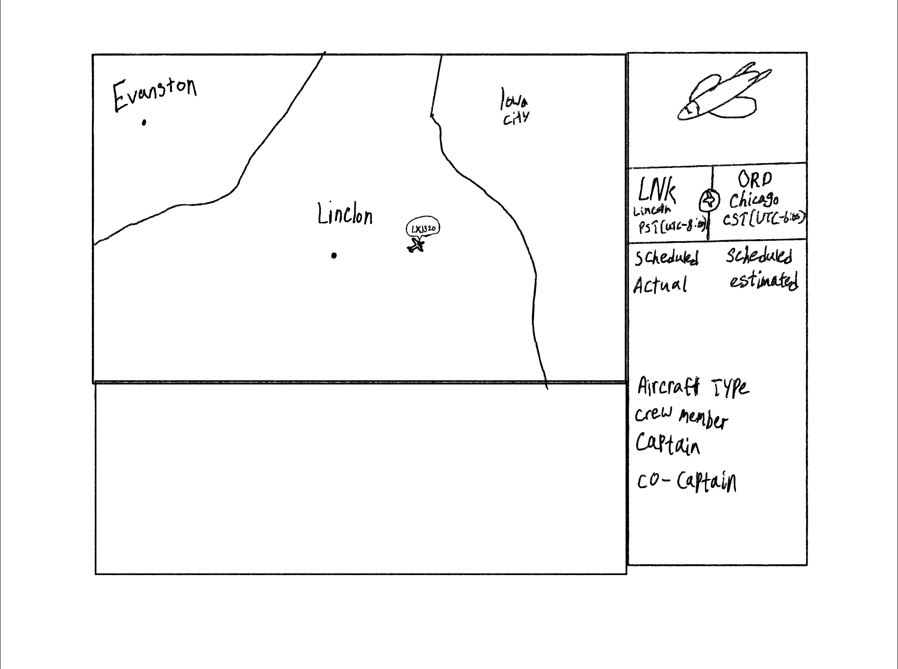

<div align='center'>
    
</div>

<br>
# Project Setup Guide
This following part provides the instructions on how to set up and run frontend and backend for out Airline Crew Scheduler app

## Frontend Setup (React + Vite)
The frontend is a React application built with Vite.

## Prerequisites

- [Node.js](https://nodejs.org/) (npm required)


### Steps 
1. **Install dependencies:**
      ```bash
    npm install
    ```
2. **Run the development server:**
      ```bash
    npm run dev
    ```
    The application will be accessible at `http://localhost:5173` (or another port if 5173 is in use).

## Backend Setup (.NET Core API)

The backend is a .NET 9 API with a SQL Server database.

### Prerequisites

- [.NET 9 SDK](https://dotnet.microsoft.com/download/dotnet/9.0)
- [SQL Server](https://www.microsoft.com/en-us/sql-server/sql-server-downloads) (Express Edition is sufficient)

### Steps

1.  **Configure the database connection:**
    - Create a new file named `.env` in the root directory of the project.
    - Open the `.env.example` file to see the required environment variables.
    - Add the following line to your `.env` file, replacing the placeholder with your actual SQL Server connection string:
      ```
      CONNECTION_STRING="Server=localhost\SQLEXPRESS;Database=AirlineSchedulerDB;Trusted_Connection=True;TrustServerCertificate=True;"
      ```
    - **Note:** Your server name might be different (e.g., `localhost`, `(localdb)\mssqllocaldb`). Adjust the `Server` part of the connection string accordingly.

2. **Apply database migrations:**
  -Open the terminal and navigate to the backend server directory:
      ```bash
      cd Server/Server
      ```
  - Use the Entity Framework Core tools to apply the migrations. This will create the database and its tables.
    ```bash
    dotnet ef database update
    ```

3.  **Run the backend server:**
    - From the `Server/Server` directory, run the application:
      ```bash
      dotnet run
      ```
    - The API will be running and accessible at the URLs specified in `Properties/launchSettings.json` (e.g., `http://localhost:5000` or `https://localhost:5001`).

<br>

# Introduction 

Cornhusker Airways Crew Scheduler is a fun class project building a regional airline scheduling system that provides intuitive airline information and a crew assignment system. This project explores real-world software design concepts such as using APIs, SQL Server, validation, and logging.

The goal of this project is to build a functional and maintainable scheduler that displays essential flight information and clearly informs crew members which flights they are scheduled on!

By simulating the development of this software, it helps us practice software design, data organization, and user-friendly frontend design.

---

# Requirement

**1) Employee role**: Our employee at CHA will have their unique role and responsibility! The crew positions are:
<ul>
  <li><strong>Captain</strong> - One of two cockpit positions. The captain must be a qualified pilot for the particular
aircraft.</li>
<br>
  <li>
      <strong>First Officer</strong> - One of two cockpit positions. The first officer must be a qualified pilot or co-pilot
for the particular aircraft.
  </li>
<br>
  <li>
    <strong>Flight Attendant</strong> - Crew member(s) who are responsible for the safety of passengers in the main
cabin.
  </li>
</ul>

**2) Aircraft Type**: CHA operates two types of passenger aircraft: GBR-10 and NU-150. Each flight must have flightID, registrationID, and crewMembers (a captain, first officer, plus one flight attendant for every 50 passenger!).

**3) Standby Crew**: Each airport must have a full standby crew for each type of aircraft, though the standby crew
members may be assigned to flights individually rather than as an atomic crew.

**4) Logging** Updates to the schedule must be maintained in an electronic log that can be searched by flight,
crew member, airport, and/or date range. Each update will generate a unique update number. The
update number format must include semantically significant information that is interpretable by
humans, such as including the date of the change and/or the date of the flight as part of the
update number. The possible updates are omitted here for brevity and will be provided later.
Any time the schedule is updated, the software must check those constraints. If any of the
constraints are violated, the software must alert the user to the violation(s).

---

# Demo



- **🖥️ Frontend - Built with React** The frontend of Cornhusker Airways is developed using React, providing a responsive and interactive user experience. Our main objectives for the UI are clarity, simplicity, and ease of navigation for both flight crew and administrators.

The React interface displays key information such as:
<ul>
  <li>
    <strong>✈️ Available flights</strong>
  </li>
  <li>
    <strong>👨‍✈️ Assigned crew members</strong>
  </li>
   <li>
    <strong>🕒 Departure and arrival times</strong>
   </li>
    <li>
    <strong>📍 Airport details</strong>
     </li>
     <li>
    <strong>🗂️ Schedules organized by date</strong>
     </li>
</ul>
<br>
Our frontend communicates with the backend through our designed API, allowing real-time display of scheduling updates and flight information.

With the airway scheduling software, CHA crew members can quickly see which flights they are assigned to.

- **🛠️ Backend – Flight & Crew Scheduling Logic:**
The backend of Cornhusker Airways is responsible for handling all scheduling logic, data management, and validation. Essentially, our backend ensures the accuracy of our flight information and correctly assigns flights to our crew members.

<ul>
  <li>
      <strong>🔄 Flight Data Management:</strong> We use C# as our middleware to perform all CRUD operations on our SQL Express database. This allows us to manage our data and constantly update our database efficiently.
  </li>

  <li>
    <strong>👨‍✈️ Crew Assignment Handling:</strong> Managing which crew members are assigned to each flight, ensuring no scheduling conflicts.
  </li>

  <li>
    <strong>📅 Schedule Validation:</strong> 
    <br>
    Ensuring that crew assignments follow rules such as:
    <ul>
      <li><strong>Ensures no overlapping flights</strong></li>
      <li><strong>Checks crew rest time requirements</strong></li>
      <li><strong>Validates correct crew roles for each aircraft</strong></li>
    </ul>
  </li>
</ul>

---

# Contributor
<ul>
  <li>
  <a href="https://github.com/ethanol25">Ethan Dye</a>
  </li>
  <li>
    <a href="https://github.com/alishlaibah">Ali Shlaibah</a>
  </li>

  <li>
    <a href="https://github.com/JacobDDoS">Jacob Dimmitt</a>
  </li>

  <li>
    <a href="https://github.com/toschaef">Thomas Osborne Michael Schaefer</a>
  </li>

  <li>
    <a href="https://github.com/liuyushen123">Yuchen Liu</a>
  </li>

  

  <li>
    <a href="https://github.com/estrasburg">Evan Strasburg</a>
  <li>
    <a href="https://github.com/R-teach-des">Rushikkumar Prajapati</a>
    <a href="https://github.com/Ricky-1553">Rushik</a>
  
      
</ul>


